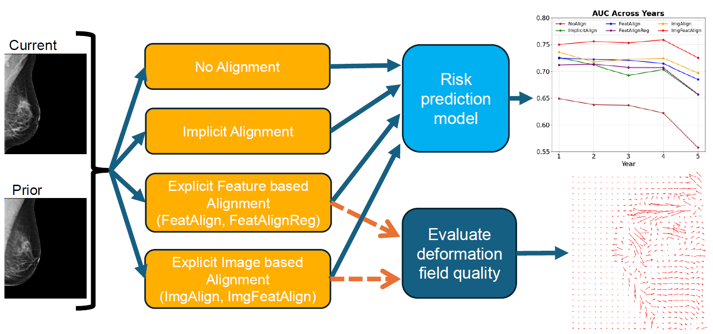

# The Impact of Longitudinal Mammogram Alignment on Breast Cancer Risk Assessment

Code of the paper "The Impact of Longitudinal Mammogram Alignment on Breast Cancer Risk Assessment". 

## Table of Contents
1. 📘 [Introduction](#introduction)  
2. ⚙️ [Method](#method)  
3. 🔍 [Key findings of the paper](#key-findings-of-the-paper)  
4. 📚 [Datasets](#datasets)  
5. ▶️ [Reproduction of the results](#reproduction-of-the-results)  
6. 📄 [Citation](#citation)  

## Introduction
This project focuses on breast cancer risk prediction using longitudinal mammography. 
By incorporating both current and prior scans, the model captures temporal changes in breast tissue, leading to improved prediction accuracy. 
Accurately modeling these changes requires proper alignment across time points.
Alignment can be performed explicitly—by registering images or their feature representations—or implicitly, using deep learning models that learn temporal dependencies directly from data.
Although several alignment methods have been proposed, their effectiveness for downstream tasks such as risk prediction remains underexplored. 
This project provides a unified framework to compare alignment techniques and examine how alignment quality influences predictive performance.

This repository provides the code necessary to:
- Train a deep learning-based image registration model for longitudinal mammography images (MammoRegNet)
- Register longitudinal mammography images using a trained MammoRegNet model
- Perform breast cancer risk prediction employing different alignment methods for longitudinal mammography images

## Method
We compare six alignment strategies for longitudinal breast cancer risk prediction:

- **NoAlign:** Direct feature extraction without any alignment between time points. Serves as the baseline.

- **ImplicitAlign:** Temporal dependencies are learned directly from the data without any explicit alignment or deformation modeling.

- **Feature-Level Alignment:**  
  - **FeatAlign**: Joint training of the alignment module and risk prediction model using an L2 alignment loss.
  - **FeatAlignReg**: Extension of *FeatAlign* with an added regularization loss to promote more stable and accurate alignment.

- **Image-Level Alignment:**  
  - **ImgAlign**: Applies MammoRegNet to align mammograms before feature extraction.
  - **ImgFeatAlign**: Applies MammoRegNet’s deformation field in the feature space to warp extracted features instead of images.

  

## Key findings of the paper

- 🔄 Comparative study of alignment strategies for longitudinal mammography.  
- 📈 Alignment improves accuracy of temporal breast cancer risk prediction.  
- ⚖️ Explicit alignment methods outperform implicit alignment approaches.  
- 🔧 Deformation improves, but regularized feature alignment lowers risk prediction.  
- 🥇 Feature-space warping with image-based deformation fields performs best.  

## Datasets
We used two large, publicly available mammography datasets :
- **Emory Breast Imaging Dataset (EMBED)**: https://aws.amazon.com/marketplace/pp/prodview-unw4li5rkivs2#overview}
- **Cohort of Screen-Aged Women Case Control (CSAW-CC)**: https://snd.se/en/catalogue/dataset/2021-204-1

##  Reproduction of the results
For reproducing the results follow the instructions below:

**Important**: for each script in the `scripts` folder, make sure you update the paths to load the correct datasets and export the results in your favorite directory.

### 1) Requirements
Requirements are in the requirements.txt file

### 2) Pre-processing of the datasets
The preprocessing step ensures that the datasets are properly prepared before training.

The `preprocessing` folder contains  the necessary scripts to preprocess images and split the datasets into training, validation and test.

To preprocess the EMBED dataset, use: `preprocessing/preprocess_img_embed.py`

To preprocess the CSAW-CC dataset, use: `preprocessing/preprocess_img_csaw_cc.py`

To split both datasets into training, validation, and test sets, use: `preprocessing/split_data.py`

For the risk prediction, create a CSV file describing your dataset by running the notebooks in the `notebooks` folder

### 3) Training 
#### 3.1) MammoRegNet
For training MammoRegNet run `scripts/train_MammoRegNet.sh`

#### 3.2) Risk prediction models
For training the risk prediction models run `scripts/train_Risk_NoAlign.sh`, `scripts/train_Risk_ImplicitAlign.sh`, `scripts/train_Risk_FeatAlign.sh`, `scripts/train_Risk_FeatAlignReg.sh`, `scripts/train_Risk_ImgAlign.sh`, and `scripts/train_Risk_ImgFeatAlign.sh`

### 4) Inference 
#### 4.1) MammoRegNet
Run `scripts/test_MammoRegNet.sh`

#### 4.2) Risk prediction models
Run `scripts/test_Risk_NoAlign.sh`, `scripts/test_Risk_ImplicitAlign.sh`, `scripts/test_Risk_FeatAlign.sh`, `scripts/test_Risk_FeatAlignReg.sh`, `scripts/test_Risk_ImgAlign.sh`, and `scripts/test_Risk_ImgFeatAlign.sh`

## Citation
